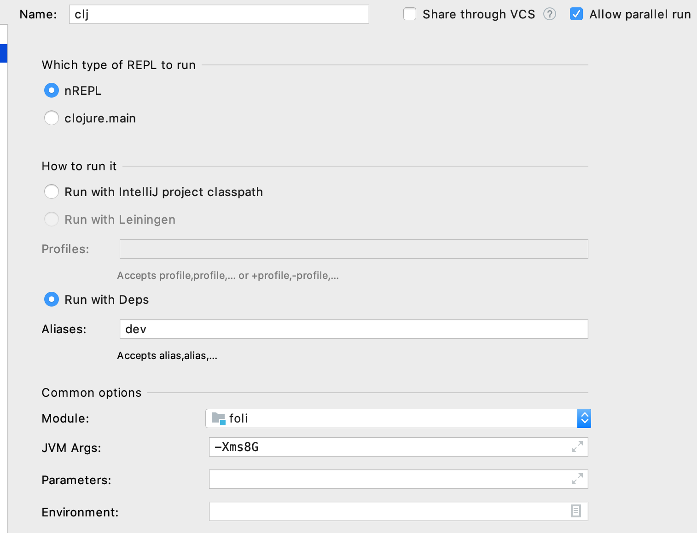

# Foli

Foli (parempi nimi TBD) on tehty helpottamaan Turun seudun joukkoliikenteen käyttöä.
Apua tähän saadaan Fölin rajapinnasta Turun joukkoliikenteen aikataulu- ja reittipalveluun.

https://data.foli.fi/doc/index

Joku saattaisi käyttää rajapintaa suoraan frontista, mutta siinä missaisi mahdollisuuden saada palautetta koko stäkistä.

## Ohjeet

Toivottavasti en unohtanut ohjeista mitään. Anteeksi jos ei toimi.

#### Suoritus

TODO: Docker

Versioita
```
java version "1.8.0_202"
Java(TM) SE Runtime Environment (build 1.8.0_202-b08)
Java HotSpot(TM) 64-Bit Server VM (build 25.202-b08, mixed mode)

Clojure 1.10.1

Docker version 19.03.13, build 4484c46d9d
docker-compose version 1.27.4, build 40524192

$ node --version
v14.9.0

$ npm --version
6.14.8
```

Tietokanta ylös
```
docker-compose up -d
```
Uberjar build ja run. HUOM! Tää on hidas
```
./build.sh && ./run.sh
```

#### Devaus quickstart

Tietokanta
```
docker-compose up
```
Frontti, ensin server pystyyn HUOM. "server version: x.x.x running at http://localhost:xxxx" ja nrepl server port 
```
$ shadow-cljs server
shadow-cljs - config: /Users/tuomas.koivistoinen/git/foli/shadow-cljs.edn
shadow-cljs - starting via "clojure"
shadow-cljs - HTTP server available at http://localhost:8000
shadow-cljs - HTTP server available at http://localhost:8023
shadow-cljs - server version: 2.11.0 running at http://localhost:9630
shadow-cljs - nREPL server started on port 64383
```
Tuolla outputilla server gui on http://localhost:9630 ja nREPL yhteyden saa portista 64383.
Server gui kautta saa frontin buildin päälle.


nREPL portin avulla saa yhteyden nrepl serveriin.


nREPL serverin replissä voi ottaa yhteyden johonkin buildiin

````
(shadow/repl :main)
=> [:selected :main]
````

Clj repliin dev alias.



```
clj -A:dev 
Clojure 1.10.1
user=> 
```

Serverin saa käyntiin user/start, käynnistettyä uudelleen user/restart ja pysäytettyä server/stop

```
user=> (start)
#object[clojure.lang.AFunction$1 0x36580bdc "clojure.lang.AFunction$1@36580bdc"]
user=> (restart)
:reloading (foli.models.trips foli.models.stops foli.parser foli.server foli.database foli.core user)
#object[clojure.lang.AFunction$1 0x59155368 "clojure.lang.AFunction$1@59155368"]
user=> (server/stop)
nil
```

Datan hakuun ja tietokannan alustukseen löytyy funktioita database namespacesta.
init-db! hakee kaiken gtfs datan ja vie tietokantaan.
```
user=> (require '[foli.database :as db])
nil
user=> (db/init-db!)
copying agency.txt
copying calendar_dates.txt
...
...
loading stop_times of [agency calendar calendar_dates routes shapes trips stops translations stop_times]
"Elapsed time: 134374.511125 msecs"
nil
```

Kun serveri on käynnissä, niin http://localhost:3000/ löytyy frontti.
Jos frontin buildi on päällä, niin hot reload ja cjls repl pitäisi toimia.

#### Ajatuksia ennen koodausta
[Tuote](docs/tuote.md)   
[Tekniikka](docs/tekniikka.md)  
[Design](docs/design.md) 
